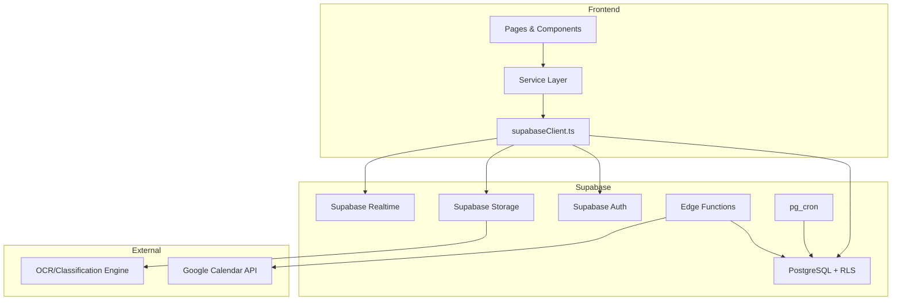

# 📋 PericiaPro Migration — Executive Report

**Migration:** PericiaPro (Base44 Legacy) → RV-Adv Module (Supabase/React)  
**Status:** ✅ Complete  
**Date:** 2026-03-02  

---

## Summary

All `@base44/sdk` dependencies have been eliminated from the PericiaPro codebase. The application now runs entirely on **Supabase** (Auth, PostgreSQL, Storage, Edge Functions, Realtime) with a clean service-layer architecture.

| Metric | Before | After |
|--------|--------|-------|
| Active base44 imports | 14 files | **0 files** |
| Service abstraction | None (direct SDK) | 8 typed services |
| Database | JSON entities | 7 PostgreSQL tables |
| Auth | base44.auth | Supabase Auth |
| Notifications | 5-min polling (428 LOC) | pg_cron + Realtime (50 LOC shim) |
| Serverless functions | Base44 functions | 2 Supabase Edge Functions |
| RLS | Declarative JSON | Native PostgreSQL policies |

---

## Architecture



---

## Files Created

### Service Layer (`src/modules/periciapro/`)

| File | Purpose |
|------|---------|
| [supabaseClient.ts](file:///c:/Users/Junior%20do%20Titico/Desktop/PericiaPro/src/modules/periciapro/services/supabaseClient.ts) | Singleton Supabase client |
| [types.ts](file:///c:/Users/Junior%20do%20Titico/Desktop/PericiaPro/src/modules/periciapro/types.ts) | TypeScript interfaces for all entities |
| [periciaService.ts](file:///c:/Users/Junior%20do%20Titico/Desktop/PericiaPro/src/modules/periciapro/services/periciaService.ts) | CRUD for pericias |
| [activityLogService.ts](file:///c:/Users/Junior%20do%20Titico/Desktop/PericiaPro/src/modules/periciapro/services/activityLogService.ts) | Activity logging |
| [lembreteService.ts](file:///c:/Users/Junior%20do%20Titico/Desktop/PericiaPro/src/modules/periciapro/services/lembreteService.ts) | Reminder management |
| [notificationServiceSupabase.ts](file:///c:/Users/Junior%20do%20Titico/Desktop/PericiaPro/src/modules/periciapro/services/notificationServiceSupabase.ts) | Notifications + Realtime |
| [notificationPreferencesService.ts](file:///c:/Users/Junior%20do%20Titico/Desktop/PericiaPro/src/modules/periciapro/services/notificationPreferencesService.ts) | User preferences |
| [storageService.ts](file:///c:/Users/Junior%20do%20Titico/Desktop/PericiaPro/src/modules/periciapro/services/storageService.ts) | Document upload + GED-IA |
| [calendarService.ts](file:///c:/Users/Junior%20do%20Titico/Desktop/PericiaPro/src/modules/periciapro/services/calendarService.ts) | Google Calendar sync |

### SQL Migrations (`supabase/migrations/`)

| File | Content |
|------|---------|
| [001_periciapro_schema.sql](file:///c:/Users/Junior%20do%20Titico/Desktop/PericiaPro/supabase/migrations/001_periciapro_schema.sql) | 7 tables, constraints, trigger |
| [002_periciapro_rls.sql](file:///c:/Users/Junior%20do%20Titico/Desktop/PericiaPro/supabase/migrations/002_periciapro_rls.sql) | Row Level Security policies |
| [003_periciapro_indexes.sql](file:///c:/Users/Junior%20do%20Titico/Desktop/PericiaPro/supabase/migrations/003_periciapro_indexes.sql) | Performance indexes |
| [004_pg_cron_alerts.sql](file:///c:/Users/Junior%20do%20Titico/Desktop/PericiaPro/supabase/migrations/004_pg_cron_alerts.sql) | Daily deadline alert job |

### Edge Functions (`supabase/functions/`)

| Function | Replaces |
|----------|----------|
| [sync-google-calendar](file:///c:/Users/Junior%20do%20Titico/Desktop/PericiaPro/supabase/functions/sync-google-calendar/index.ts) | `syncToGoogleCalendar.ts` |
| [delete-google-calendar](file:///c:/Users/Junior%20do%20Titico/Desktop/PericiaPro/supabase/functions/delete-google-calendar/index.ts) | `deleteFromGoogleCalendar.ts` |

---

## Files Modified

| File | Changes |
|------|---------|
| [Dashboard.jsx](file:///c:/Users/Junior%20do%20Titico/Desktop/PericiaPro/src/pages/Dashboard.jsx) | 9 call sites → periciaService, calendarService |
| [CadastroCliente.jsx](file:///c:/Users/Junior%20do%20Titico/Desktop/PericiaPro/src/pages/CadastroCliente.jsx) | 3 → periciaService, activityLogService |
| [DetalhesCliente.jsx](file:///c:/Users/Junior%20do%20Titico/Desktop/PericiaPro/src/pages/DetalhesCliente.jsx) | 6 → all services |
| [Alertas.jsx](file:///c:/Users/Junior%20do%20Titico/Desktop/PericiaPro/src/pages/Alertas.jsx) | 3 → periciaService |
| [Calendario.jsx](file:///c:/Users/Junior%20do%20Titico/Desktop/PericiaPro/src/pages/Calendario.jsx) | 1 → periciaService |
| [NotificationSettings.jsx](file:///c:/Users/Junior%20do%20Titico/Desktop/PericiaPro/src/pages/NotificationSettings.jsx) | 4 → notificationPreferencesService |
| [Layout.jsx](file:///c:/Users/Junior%20do%20Titico/Desktop/PericiaPro/src/Layout.jsx) | Auth + Pericia list → useAuth + periciaService |
| [NotificationBell.jsx](file:///c:/Users/Junior%20do%20Titico/Desktop/PericiaPro/src/components/notifications/NotificationBell.jsx) | 4 → notificationService |
| [NotificationService.jsx](file:///c:/Users/Junior%20do%20Titico/Desktop/PericiaPro/src/components/notifications/NotificationService.jsx) | 428→50 LOC (no-op shim) |
| [RemindersTab.jsx](file:///c:/Users/Junior%20do%20Titico/Desktop/PericiaPro/src/components/cliente/RemindersTab.jsx) | 4 → lembreteService, activityLogService |
| [DocumentsTab.jsx](file:///c:/Users/Junior%20do%20Titico/Desktop/PericiaPro/src/components/cliente/DocumentsTab.jsx) | 5 → storageService, periciaService |
| [GoogleCalendarSync.jsx](file:///c:/Users/Junior%20do%20Titico/Desktop/PericiaPro/src/components/calendar/GoogleCalendarSync.jsx) | 1 → calendarService |
| [AuthContext.jsx](file:///c:/Users/Junior%20do%20Titico/Desktop/PericiaPro/src/lib/AuthContext.jsx) | Full rewrite → Supabase Auth |
| [PageNotFound.jsx](file:///c:/Users/Junior%20do%20Titico/Desktop/PericiaPro/src/lib/PageNotFound.jsx) | auth.me() → useAuth hook |
| [api/entities.js](file:///c:/Users/Junior%20do%20Titico/Desktop/PericiaPro/src/api/entities.js) | Deprecation bridge |
| [api/integrations.js](file:///c:/Users/Junior%20do%20Titico/Desktop/PericiaPro/src/api/integrations.js) | Deprecation bridge |

---

## Validation Results

```
grep -ri 'from "@/api/base44Client"' src/ → 0 results ✅
grep -i 'base44' package.json → 0 results ✅
grep -i 'base44' vite.config.js → 0 results ✅
```

> [!NOTE]
> The remaining `base44` references are only in JSDoc comments inside service files (e.g., "replaces base44.entities.Pericia.*") — harmless documentation artifacts.

---

## Pre-Deploy Checklist

1. **Run `npm install`** — ensure `@supabase/supabase-js` is installed
2. **Configure `.env`** with `VITE_SUPABASE_URL` and `VITE_SUPABASE_ANON_KEY`
3. **Execute SQL migrations** in Supabase Dashboard (SQL Editor → paste each file in order)
4. **Deploy Edge Functions**: `supabase functions deploy sync-google-calendar` and `supabase functions deploy delete-google-calendar`
5. **Enable pg_cron**: Uncomment the `cron.schedule()` call in `004_pg_cron_alerts.sql`
6. **Set Edge Function secrets**: `GOOGLE_CALENDAR_ACCESS_TOKEN` via `supabase secrets set`
7. **Create Supabase Storage bucket**: `periciapro-documents` (private)
8. **Delete legacy files** (optional): `src/lib/NavigationTracker.jsx`, `src/lib/app-params.js`, `src/api/base44Client.js`, `entities/`, `functions/`
